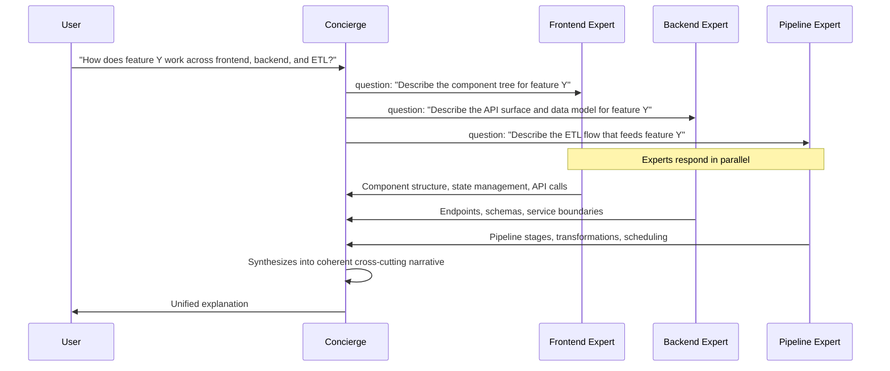
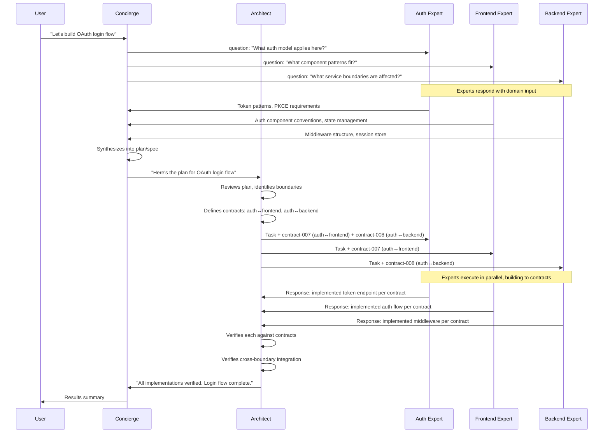
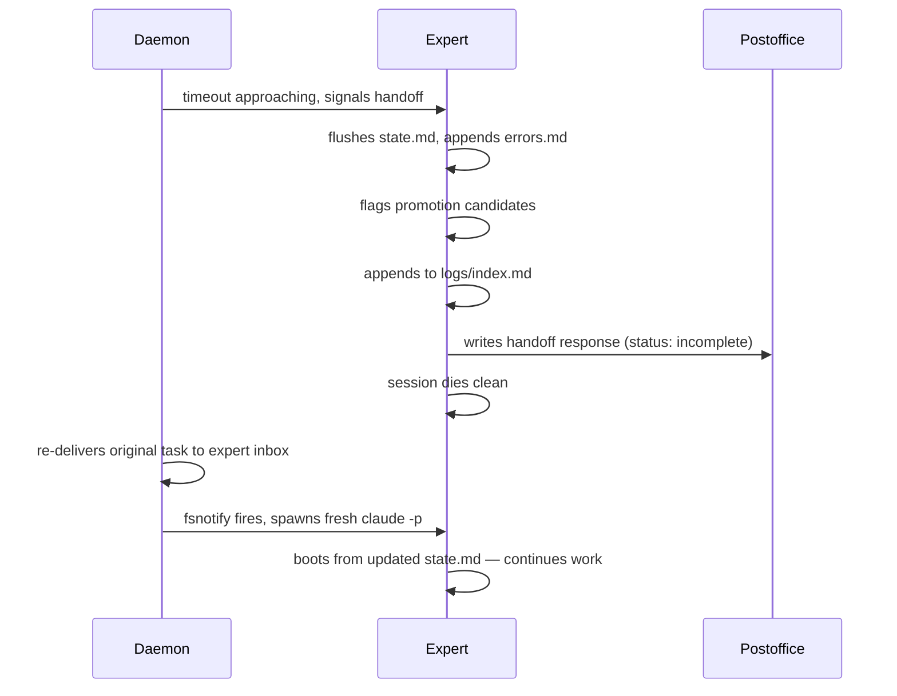
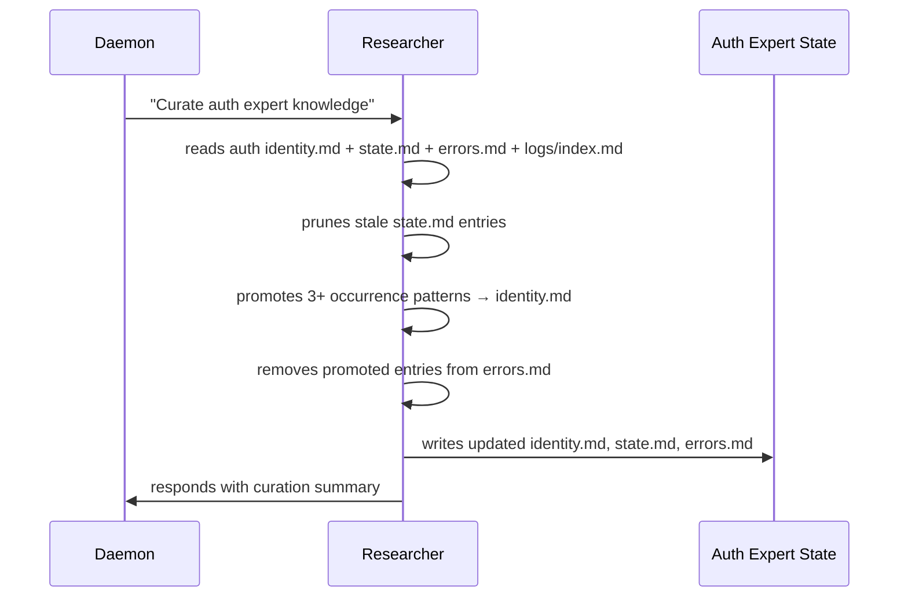
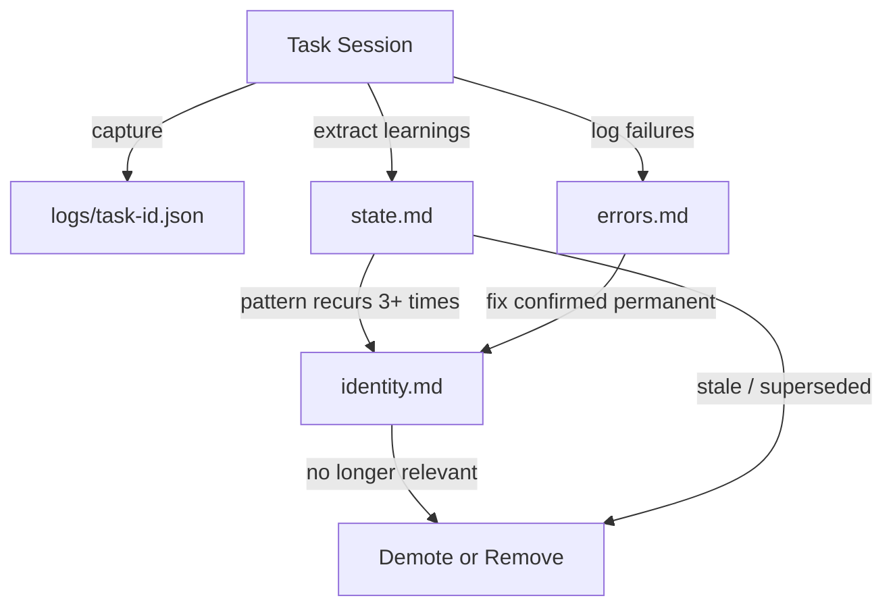

# Agent Pool

A process supervisor that manages headless Claude Code expert sessions, activated by filesystem-based mail delivery, with externalized state replacing conversation persistence.

## Problem

A monolithic Claude Code session that touches frontend, auth, infra, and pipeline work accumulates context that can't be selectively pruned. One rabbit hole burns context budget for every future turn. `--resume` is all-or-nothing — there's no way to forget turns 15-40 while keeping the rest. Subagents are fire-and-forget with no persistent identity. Agent Teams are ephemeral parallel bursts, not long-lived specialists.

We need experts that maintain domain knowledge across tasks without carrying the full weight of every conversation that produced that knowledge.

## Core Idea

Each expert is a **fresh Claude Code session** that boots from externalized state, does work, updates its state, and dies. The session is disposable. The knowledge isn't. As Everett Quebral identified in Gas Town: the real move is "not more agents — durable work state" [5].

The user-facing agent (concierge) is the **lightest** agent in the system. It delegates everything heavy, keeping the conversation fluid, dynamic, and unblocked. Domain work goes to experts. Architecture and verification go to the architect. Research and knowledge enrichment go to the researcher.

## Architecture

```
┌──────────────────────────────────────────────────────────────┐
│                         agent-pool                            │
│                    (Go process supervisor)                     │
│                                                                │
│  ┌──────────────┐                                             │
│  │  Concierge    │  ← interactive session (user's claude)      │
│  │  (PM role)    │  ← only role that talks to the user         │
│  │  ← delegates  │  ← builds plans from expert input           │
│  └──────┬───────┘                                             │
│         │                                                      │
│    read path (direct)              write path (via architect)  │
│         │                                │                     │
│         ▼                                ▼                     │
│  ┌──────────────┐              ┌──────────────┐               │
│  │   Experts     │◄─────────────│  Architect    │  ← headless   │
│  │  (domain      │  tasks +     │  (tech lead)  │  ← defines    │
│  │   specialists)│  contracts   │  ← delegates  │    contracts  │
│  └──────────────┘              │  ← verifies   │               │
│                                 │  ← Opus       │               │
│  ┌──────────────┐              └──────────────┘               │
│  │  Researcher   │  ← on-demand (user or architect)            │
│  │  (enrichment) │  ← improves expert knowledge                │
│  │  ← curation   │  ← cold-start seeding                      │
│  └──────────────┘                                             │
└──────────────────────────────────────────────────────────────┘
```

### Roles

| Role | Model | Session Type | Talks To | Responsibility |
|------|-------|-------------|----------|----------------|
| **Concierge** | Sonnet | Interactive (`--resume`) | User, Experts, Architect | Understand intent, ask targeted questions, build plans, synthesize results, keep conversation fluid |
| **Architect** | Opus | Headless (`-p`) | Concierge, Experts | Review plans, define contracts, delegate tasks, verify execution against spec |
| **Expert** | Sonnet | Headless (`-p`) | Concierge (questions), Architect (tasks) | Domain work — answer questions, execute tasks, maintain domain knowledge |
| **Researcher** | Sonnet/Haiku | Headless (`-p`) | Experts (enriches state) | Codebase exploration, doc reading, expert knowledge enrichment, cold-start seeding, curation |

### Primary Artifacts

| Role | Artifacts |
|------|-----------|
| **Concierge** | Plans/specs (what to build, why) |
| **Architect** | Contracts (interfaces between experts), verification reports |
| **Expert** | Code changes, domain knowledge updates |
| **Researcher** | Expert state enrichment, curation results |

## Principles

1. **If there's work on your hook, you run it.** (Gas Town's GUPP — [1][9].) Experts don't wait for permission. Mail lands, expert wakes, expert works. Pull-based activation, not push-based orchestration.
2. **Filesystem is the message bus.** No databases, no queues, no MCP, no network calls between agents. Files in, files out. `fsnotify` as the activation primitive.
3. **Every session is born clean.** Experts never use `--resume`. Fresh `claude -p` invocation per task. State rehydrated from disk.
4. **Knowledge has a lifecycle.** Learnings start in task logs, get captured in `state.md`, and graduate to `identity.md` when they prove durable. Errors get recorded in `errors.md`. This is the promotion ladder — not a flat accumulation.
5. **The user-facing agent is the lightest in the system.** The concierge delegates everything heavy. Domain work, architecture, verification, research — all dispatched. The conversation never blocks.
6. **Zero tokens at rest.** Sleeping experts cost nothing. Only the active invocation burns tokens.
7. **Contracts before code.** The architect defines interfaces between experts before work starts. Experts build to contracts. Verification checks against contracts. This is what makes parallel execution work.
8. **Topology is a directory listing.** Adding an expert = creating a directory. No config files to update, no other agents to notify.
9. **Handoff is a first-class lifecycle event.** When an expert detects context bloat, it flushes knowledge to disk, signals the daemon, and dies clean. The next session picks up from the written state.

## Directory Structure

### Pools and Shared Experts

Pools are project-scoped instances. Shared experts are user-level specialists reusable across pools.

```
~/.agent-pool/
├── config.toml                            # Global defaults (model, timeouts)
│
├── experts/                               # Shared experts (user-level, reusable)
│   ├── corporate-policies/
│   │   ├── identity.md                   # Org standards, review checklists
│   │   ├── state.md                      # Cross-project knowledge
│   │   ├── errors.md
│   │   └── logs/
│   │       └── index.md
│   ├── security-standards/
│   │   └── ...
│   └── cloud-infra/
│       └── ...
│
├── pools/
│   ├── api-gateway/                       # Project pool
│   │   ├── pool.toml                     # Pool config + shared expert includes
│   │   ├── taskboard.json                # Daemon-managed: task status, deps
│   │   ├── postoffice/                   # Central mail drop
│   │   ├── contracts/                    # Architect-managed interface specs
│   │   │   ├── contract-007.md
│   │   │   └── index.md
│   │   ├── formulas/                     # Reusable workflow templates (TOML)
│   │   │
│   │   ├── concierge/                    # Per-pool roles
│   │   │   └── state.md                  # Lightweight — just active context
│   │   ├── architect/
│   │   │   ├── identity.md
│   │   │   ├── state.md
│   │   │   └── logs/
│   │   ├── researcher/
│   │   │   ├── identity.md
│   │   │   ├── state.md
│   │   │   └── logs/
│   │   │
│   │   ├── experts/                      # Pool-scoped experts
│   │   │   ├── auth/
│   │   │   │   ├── identity.md
│   │   │   │   ├── state.md
│   │   │   │   ├── errors.md
│   │   │   │   └── logs/
│   │   │   │       └── index.md
│   │   │   ├── frontend/
│   │   │   │   └── ...
│   │   │   └── backend/
│   │   │       └── ...
│   │   │
│   │   └── shared-state/                 # Project overlays for shared experts
│   │       ├── corporate-policies/
│   │       │   └── state.md              # What this expert knows about THIS project
│   │       └── security-standards/
│   │           └── state.md
│   │
│   └── data-platform/                    # Different project pool
│       ├── pool.toml
│       ├── taskboard.json
│       ├── postoffice/
│       ├── contracts/
│       ├── concierge/
│       ├── architect/
│       ├── researcher/
│       ├── experts/
│       │   ├── etl/
│       │   ├── warehouse/
│       │   └── streaming/
│       └── shared-state/
│           └── corporate-policies/
│               └── state.md
```

### Expert State Files

Each expert (pool-scoped or shared) has three state files:

**identity.md** — Quasi-static. Role, domain, conventions, graduated patterns. Evolves slowly via promotion.

**state.md** — Dynamic working memory. Updated every task. For shared experts, split into user-level (cross-project) and project-level (overlay).

**errors.md** — Append-only failure log. Prevents repeating known mistakes.

### Shared Expert Assembly

When a pool invokes a shared expert, the daemon assembles the prompt from layered state:

```
identity.md          ← ~/.agent-pool/experts/{name}/identity.md
state.md (user)      ← ~/.agent-pool/experts/{name}/state.md
state.md (project)   ← ~/.agent-pool/pools/{pool}/shared-state/{name}/state.md
errors.md            ← ~/.agent-pool/experts/{name}/errors.md
task                 ← from the pool's mail system
```

The expert doesn't know or care that it's shared. It just sees its assembled prompt. The daemon handles the layering.

## Interaction Flows

### Read Path (Understanding, Research)

Architect not involved. No code changes. Concierge handles directly.



### Write Path (Features, Fixes, Refactors)

Full loop. Architect defines contracts and verifies execution.



### Handoff Flow



### Curation Flow (Researcher)



## Contracts

Contracts are interface specifications the architect defines between experts before work starts. They make parallel execution safe by declaring the boundaries.

### Contract Format

```markdown
---
id: contract-007
type: contract
defined-by: architect
between: [auth, frontend]
version: 1
timestamp: 2026-04-01T14:32:00Z
---

## Auth ↔ Frontend: Token Exchange

### POST /api/auth/token
Request:
\`\`\`json
{ "grant_type": "authorization_code", "code": "string", "redirect_uri": "string" }
\`\`\`

Response (200):
\`\`\`json
{ "accessToken": "string", "expiresAt": "ISO8601", "refreshToken": "string" }
\`\`\`

### Constraints
- accessToken is a JWT, max 15min TTL
- refreshToken is opaque, 7d sliding window
- Frontend MUST NOT decode the JWT — treat as opaque bearer token
- Auth MUST return consistent error shape across all auth endpoints
```

### Contract Lifecycle

1. **Architect defines contracts** based on the concierge's plan and expert input
2. **Experts receive contracts** as part of their task — contracts are non-negotiable during execution
3. **Experts flag contract issues** in their response if they believe a contract needs amendment (they do not deviate silently)
4. **Architect verifies** each expert's output against the contract spec
5. **Architect amends** contracts if needed (version increment, notify all parties via daemon fan-out)

### What the Architect Verifies

1. **Contract compliance** — Does each expert's output match the interface spec?
2. **Cross-boundary integration** — Do the pieces connect? (Auth returns what frontend expects)
3. **Plan adherence** — Does the implementation match the concierge's plan?
4. **Non-functional requirements** — Error handling, logging, test coverage per project standards

## Mail Protocol

### Message Format

Every mail file is a markdown document with a YAML header:

```markdown
---
id: task-042
from: architect
to: auth
type: task
contracts: [contract-007, contract-008]
priority: normal
depends-on: []
timestamp: 2026-04-01T14:32:00Z
---

## Task description here
```

### Message Types

| Type | Purpose | Example |
|------|---------|---------|
| `task` | Work assignment from architect | "Implement token endpoint per contract-007" |
| `question` | Targeted query from concierge | "What auth model applies to this use case?" |
| `response` | Completion report back to sender | Status, summary, artifacts, follow-ups |
| `notify` | Informational — no action required | "Token schema changed in contract-007 v2" |
| `handoff` | Expert signals context exhaustion | "Task incomplete, state flushed" |
| `cancel` | Revoke a queued task | Daemon removes from inbox before expert wakes |

### Routing

All outbound mail goes to the pool's `postoffice/`. The router (a goroutine in the daemon) reads the `to:` header and copies the file to the target's inbox. Experts never write directly to another agent's inbox.

### Delivery Guarantees

- **At-least-once.** Router copies then deletes. Crash = possible duplicate. Experts should be idempotent.
- **Unordered.** Use `depends-on` for sequencing.
- **No backpressure.** Mail queues in inbox. One task at a time per expert, FIFO.

## Knowledge Promotion Ladder



| Tier | File | Mutability | Purpose | Promotion Trigger |
|------|------|-----------|---------|-------------------|
| Archive | `logs/{task-id}.json` | Append-only | Full session transcript, recall source | Never promoted — queried on-demand |
| Working Memory | `state.md` | Updated every task | Domain knowledge, blockers, decisions | Pattern recurs 3+ times → promote to identity |
| Error Memory | `errors.md` | Append, periodic prune | Failure modes, bad approaches | Fix confirmed permanent → promote to identity |
| Identity | `identity.md` | Slow evolution | Role, conventions, graduated patterns | — (top tier) |

### Log Recall

Each expert maintains `logs/index.md` — one-line-per-task summaries. The expert reads the index to find relevant prior tasks, then reads specific log files.

Log retention: keep last 50 logs per expert. Older logs compressed to `logs/archive/`. Index retains all entries.

### The Curation Problem

A fresh session making stateful curation decisions is a circular dependency. Mitigation: the **researcher** runs periodic curation tasks where the entire job is reviewing an expert's state holistically — pruning, promoting, staleness detection. Regular experts do lightweight append-only updates; heavy curation is a dedicated session.

## Integration Surface

Agent Pool builds ON Claude Code, not INTO it. Integration through external interfaces only.

| Interface | How Agent Pool Uses It |
|-----------|------------------------|
| **CLI flags** | `claude -p --output-format stream-json --model sonnet --allowedTools "..."` |
| **MCP server** | `agent-pool mcp --pool {name} --expert {name}` — typed tools per role |
| **Hooks** | Stop → flush guarantee. PreToolUse → code ownership guard |
| **Plugin** | Skills for concierge workflows, expert protocol |
| **Environment variables** | `AGENT_POOL_NAME`, `AGENT_POOL_EXPERT`, `AGENT_POOL_TASK_ID` |

### MCP Server

The daemon spawns an MCP server alongside each headless session. Different tool sets per role:

**Expert tools:**

| Tool | Purpose |
|------|---------|
| `pool_update_state` | Write updated state.md (validates format, accepts `scope: "user" \| "project"` for shared experts) |
| `pool_append_error` | Append a structured error entry to errors.md |
| `pool_flag_promotion` | Mark a pattern as a promotion candidate |
| `pool_send_response` | Write response mail to postoffice |
| `pool_send_notify` | Send a notify to another expert via postoffice |
| `pool_recall` | Read a prior task log by ID |
| `pool_search_index` | Search logs/index.md for relevant prior tasks |
| `pool_signal_handoff` | Flush state and signal handoff |
| `pool_read_state` | Read current state.md (merged view for shared experts) |

**Architect tools** (expert tools plus):

| Tool | Purpose |
|------|---------|
| `pool_define_contract` | Write a contract to the contracts directory |
| `pool_send_task` | Delegate a task to an expert with contract references |
| `pool_verify_result` | Log verification outcome against a contract |
| `pool_amend_contract` | Update a contract (version increment, notify parties) |

**Researcher tools** (expert tools plus):

| Tool | Purpose |
|------|---------|
| `pool_enrich_state` | Update a shared expert's user-level state |
| `pool_promote_pattern` | Promote a pattern from state.md to identity.md |

### Concierge Integration

The concierge is the user's interactive session — not spawned by the daemon. It uses a Claude Code plugin:

```
agent-pool-plugin/
├── plugin.json
├── .mcp.json                          # MCP server for concierge sessions
├── skills/
│   ├── pool-ask.md                   # Read path: ask experts, synthesize
│   ├── pool-build.md                 # Write path: gather input → plan → architect
│   ├── pool-status.md                # Check task/pool status
│   └── expert-protocol.md            # Loaded into headless expert sessions
└── agents/
    ├── architect.md                   # Architect agent definition
    └── researcher.md                  # Researcher agent definition
```

**Concierge MCP tools:**

| Tool | Purpose |
|------|---------|
| `pool_ask_expert` | Send a question to an expert, get response |
| `pool_submit_plan` | Send a plan to the architect for review |
| `pool_check_status` | Query taskboard for in-flight work |
| `pool_request_research` | Trigger researcher for expert enrichment |
| `pool_list_experts` | Show available experts (pool-scoped + shared) |

### Hooks

```json
{
  "hooks": {
    "Stop": [{
      "command": "agent-pool flush --pool $AGENT_POOL_NAME --expert $AGENT_POOL_EXPERT --task $AGENT_POOL_TASK_ID"
    }],
    "PreToolUse": [{
      "matcher": "Write|Edit",
      "command": "agent-pool guard --pool $AGENT_POOL_NAME --expert $AGENT_POOL_EXPERT --path $CLAUDE_TOOL_ARG_FILE_PATH"
    }]
  }
}
```

## Daemon Responsibilities

> **Complexity acknowledgment:** The daemon is 3-4k LOC of careful systems programming. Signal handling, graceful shutdown, race conditions on concurrent file writes, PID tracking, at-least-once delivery. This is a proper systems project.

| Function | Complexity |
|----------|------------|
| File watching (`fsnotify`) | Low |
| Mail routing (postoffice → inbox) | Low |
| Cancel handling (remove from inbox before spawn) | Medium |
| Expert spawning (`os/exec` → `claude -p`) | Medium |
| Process supervision (PID tracking, one-at-a-time) | Medium |
| Log capture (tee output to `logs/`, append index) | Low |
| Task board (`taskboard.json` — status, deps) | Medium |
| Dependency scheduling (evaluate DAG per response) | Medium |
| Health checking (timeout → handoff signal) | Medium |
| Handoff tracking (escalate after 2 handoffs) | Low |
| Contract notification fan-out | Low |
| Config reload (watch pool.toml) | Low |
| Formula loading (parse TOML) | Low |
| Expert discovery (scan `*/inbox/` dirs) | Low |
| Log rotation (compress beyond retention) | Low |
| MCP server (stdio per-expert, role-based tools) | Medium |
| Shared expert state assembly (layered prompt) | Low |

## Configuration

### Global Config

```toml
# ~/.agent-pool/config.toml

[defaults]
model = "sonnet"
allowed_tools = ["Read", "Write", "Edit", "Bash", "Grep", "Glob"]
session_timeout = "10m"
log_retention_per_expert = 50

[curation]
interval_tasks = 10
interval_hours = 168
```

### Pool Config

```toml
# ~/.agent-pool/pools/api-gateway/pool.toml

[pool]
name = "api-gateway"
project_dir = "~/Projects/api-gateway"

[concierge]
model = "sonnet"

[architect]
model = "opus"
session_timeout = "15m"

[researcher]
model = "sonnet"

[shared]
include = ["corporate-policies", "security-standards"]

[experts.auth]
model = "sonnet"

[experts.frontend]
model = "sonnet"
allowed_tools = ["Read", "Write", "Edit", "Bash", "Grep", "Glob", "Browser"]

[experts.backend]
model = "sonnet"
```

## Human Approval Gate

Configurable oversight at the decomposition layer:

```toml
[architect]
approval_mode = "decomposition"    # "none" | "decomposition" | "all"
human_inbox = "stdout"             # "stdout" | "telegram" | "file:~/reviews/"
```

- **`none`** — Fully autonomous. Architect reviews, delegates, and verifies without waiting.
- **`decomposition`** — Architect proposes contract + task decomposition, human approves before dispatch. Default.
- **`all`** — Every task dispatch requires human approval.

## Workflow Formulas

TOML-defined templates for recurring multi-step patterns. The **daemon** evaluates dependencies and dispatches — no LLM needed for sequencing.

```toml
# formulas/feature-impl.toml
description = "Standard feature implementation flow"

[[steps]]
id = "gather"
role = "concierge"
title = "Gather expert input"
description = "Ask targeted questions to relevant experts"

[[steps]]
id = "plan"
role = "concierge"
title = "Build plan"
description = "Synthesize expert input into plan/spec"
depends_on = ["gather"]

[[steps]]
id = "review"
role = "architect"
title = "Review plan + define contracts"
description = "Review plan, identify boundaries, define contracts"
depends_on = ["plan"]

[[steps]]
id = "implement"
role = "experts"
title = "Implementation"
description = "Experts execute in parallel, building to contracts"
depends_on = ["review"]

[[steps]]
id = "verify"
role = "architect"
title = "Verification"
description = "Verify each expert's output against contracts"
depends_on = ["implement"]
```

## Adding a New Expert

### Pool-Scoped Expert

```bash
mkdir -p ~/.agent-pool/pools/api-gateway/experts/payments/{inbox,logs}
# Write identity.md, state.md, errors.md, logs/index.md
# Daemon auto-discovers on next scan — no restart required
```

### Shared Expert

```bash
mkdir -p ~/.agent-pool/experts/legal/{inbox,logs}
# Write identity.md, state.md, errors.md, logs/index.md
# Add to pool.toml: shared.include = ["legal"]
# Daemon creates shared-state/legal/ overlay on first use
```

## Resolved Decisions

- **Role separation:** Four roles — concierge (PM), architect (tech lead), experts (domain), researcher (enrichment/curation). The user-facing agent is the lightest.
- **Contracts as first-class objects:** Architect defines interface specs between experts before work starts. Experts build to contracts. Verification checks against contracts.
- **Pool isolation:** Each project gets its own pool with its own concierge, architect, experts, taskboard, contracts, and postoffice.
- **Shared experts:** User-level specialists reusable across pools. Identity lives once, project-specific knowledge in per-pool overlays. No contention — each pool has its own overlay.
- **Task board ownership:** Daemon maintains `taskboard.json` and evaluates dependencies. Not the architect's job.
- **Human oversight:** Approval gate with three modes. Default: `decomposition`.
- **Curation responsibility:** Researcher runs periodic curation tasks. Regular experts do lightweight updates.
- **Log retention:** 50 per expert, compress older, index retains all entries.
- **Cancellation:** Daemon handles cancel messages, not experts.
- **Integration model:** External only. CLI, MCP, hooks, plugin. No Claude Code source modification.
- **Read vs write paths:** Questions go directly from concierge to experts. Feature work routes through the architect for contracts and verification.
- **Concierge persistence:** Only role that uses `--resume`. Everything else is ephemeral `claude -p`.
- **Ephemeral sessions over MCP server mode:** Claude Code can run as an MCP server (`tools/list` + `tools/call`), but this exposes individual tools, not agentic reasoning. Experts need the full agentic loop (reason → pick tools → execute → iterate), which only happens in `claude -p`. Using MCP server mode would require reimplementing the query engine in Go. Persistent sessions also reintroduce the context accumulation problem Agent Pool exists to solve. MCP is used as the communication layer between roles and the daemon, not as the execution model. See ADR `docs/adr/0001-ephemeral-sessions-over-mcp-server.md`.

## Open Questions

- **Cold start seeding:** How to bootstrap an expert's state.md? Options: (a) manual seed, (b) researcher runs "learn the codebase" task, (c) extract from existing CLAUDE.md.
- **Formula evolution:** Should formulas be versioned and improvable? Orchestrator could suggest formula updates when patterns recur.
- **Multi-model routing:** Curator tasks could run on Haiku. Needs cost/quality tuning.
- **Non-coding experts (stretch goal):** Policy reviewers, architecture advisors need different identity templates and allowed tools.
- **Idempotency:** At-least-once delivery + code modification = potential double-apply. May need "task already completed" check in daemon.
- **CLI flag reconciliation:** `--print` + MCP server + `--output-format stream-json` interaction needs v0.1 testing.
- **Contract versioning:** How to handle mid-flight contract amendments without invalidating in-progress work.

## Implementation Phasing

### v0.1 — MVP: The Loop

Get mail in, expert runs, mail out. Single pool, no shared experts, no architect, no contracts.

- [ ] Go binary with `fsnotify` watching a pool's `postoffice/`
- [ ] Mail routing (read `to:`, copy to inbox, delete source)
- [ ] Expert spawning via `claude -p --output-format stream-json`
- [ ] Log capture (tee output to `logs/{task-id}.json`, append `logs/index.md`)
- [ ] Single pool directory structure
- [ ] Basic `pool.toml` parsing (model, timeout, allowed tools)
- [ ] Manual task submission (user writes markdown file to postoffice)

**Validates:** Does the basic expert lifecycle work? Does `claude -p` with assembled prompts produce useful output? Is the mail format ergonomic?

### v0.2 — MCP + State Management

Experts get typed tools instead of raw file writes.

- [ ] MCP server (stdio, per-expert) with expert tool set
- [ ] `pool_update_state`, `pool_append_error`, `pool_read_state`
- [ ] `pool_send_response`, `pool_recall`, `pool_search_index`
- [ ] Stop hook for flush guarantee
- [ ] PreToolUse hook for code ownership guard
- [ ] State file validation in MCP server

**Validates:** Do experts reliably use MCP tools for state management? Does the Stop hook fire consistently?

### v0.3 — Task Board + Dependencies

Offload bookkeeping from the LLM.

- [ ] `taskboard.json` — task status tracking
- [ ] Dependency evaluation (DAG state machine)
- [ ] Cancel message handling
- [ ] Handoff tracking + escalation
- [ ] Health checking (timeout → handoff signal)
- [ ] Process supervision (PID tracking, one-at-a-time enforcement)

**Validates:** Does the daemon reliably sequence dependent tasks? Does cancellation work without races?

### v0.4 — Architect + Contracts

The verification loop.

- [ ] Architect role with identity.md
- [ ] Contract format and storage (`contracts/`, `index.md`)
- [ ] Architect MCP tools (`pool_define_contract`, `pool_send_task`, `pool_verify_result`)
- [ ] Contract notification fan-out on amendment
- [ ] Human approval gate (decomposition mode)

**Validates:** Does the architect reliably define contracts and verify expert output? Does the approval gate feel natural?

### v0.5 — Concierge Plugin

The user-facing integration.

- [ ] Claude Code plugin with `.mcp.json`
- [ ] Concierge MCP tools (`pool_ask_expert`, `pool_submit_plan`, `pool_check_status`)
- [ ] Skills: `pool-ask`, `pool-build`, `pool-status`
- [ ] Read path flow (concierge → experts → synthesis)
- [ ] Write path flow (concierge → plan → architect → experts → verify)

**Validates:** Does the full read/write path flow feel fluid from the user's perspective?

### v0.6 — Daemon Lifecycle + Observability (added from dogfooding)

Operational foundation surfaced by dogfooding on bosun (2026-04-05).
Issues: #8, #9, #10, #11, #13.

- [ ] Unix domain socket for CLI→daemon communication (`daemon.sock`)
- [ ] `agent-pool stop` — connect to socket, send shutdown RPC
- [ ] `agent-pool status` — connect to socket, return live stats
- [ ] `agent-pool watch` — stream events via socket, render TUI dashboard
- [ ] Graceful shutdown with drain (sync.WaitGroup, 30s timeout, double-signal)
- [ ] Remove default session timeout — sessions run to completion (#11)
- [ ] Drop `pool_` prefix from MCP tool names (#13)
- [ ] launchd plist template for macOS backgrounding

**Validates:** Can you operate a pool without staring at raw JSON logs? Can you stop/restart without pkill?

### v0.7 — Shared Experts + Multi-Pool

Cross-project knowledge.

- [ ] `~/.agent-pool/experts/` shared directory
- [ ] `shared.include` in pool.toml
- [ ] Layered state assembly (user + project overlay)
- [ ] `scope` parameter in `pool_update_state`
- [ ] Per-pool `shared-state/` overlays auto-created on first use
- [ ] Multi-pool daemon (watch multiple pool directories)

**Validates:** Does the shared expert model work across pools? Does layered state assembly produce coherent prompts?

### v0.8 — Researcher + Curation

Knowledge enrichment and hygiene.

- [ ] Researcher role with identity.md
- [ ] Researcher MCP tools (`pool_enrich_state`, `pool_promote_pattern`)
- [ ] Curation scheduling (interval_tasks, interval_hours)
- [ ] Cold-start seeding ("learn the codebase" task)
- [ ] Log rotation (compress beyond retention threshold)
- [ ] Cross-pool shared expert enrichment

**Validates:** Does curation keep state.md lean over time? Does cold-start seeding produce useful initial state?

### v0.9 — Formulas + Polish

Workflow templates and operational hardening.

- [ ] TOML formula parsing
- [ ] Formula instantiation by architect
- [ ] Config hot-reload (watch pool.toml)
- [ ] Partial-write detection on mail files

**Validates:** Can common workflows be templated and reused across pools?

## Design Lineage

### From Gas Town [1][2][3][5]

| Concept | What we took | What we left |
|---------|-------------|-------------|
| GUPP | Pull-based activation | The Mad Max branding |
| Beads | Durable, git-backed work units | Dolt/SQLite data plane |
| Handoff | Controlled context refresh | Polecat-specific mechanics |
| Log recall | On-demand querying of prior logs | Interactive `--talk` mode |
| Formulas | TOML workflow templates | Full MEOW molecule stack |
| Roles | Named, narrow responsibilities | 7-role hierarchy |
| Mayor | Human approval at decomposition layer | Always-on human-in-loop |

### From OpenClaw [12][14][16][17]

| Concept | What we took | What we left |
|---------|-------------|-------------|
| Workspace-as-brain | Files define identity and memory | Always-on Gateway |
| Self-improvement | Structured error/learning capture | Plugin ecosystem |
| Promotion ladder | State → identity graduation | Automated review commands |
| Compaction flush | Memory flush before pruning | Automatic compaction |
| Identity split | Execution rules vs. persona | Full file taxonomy |

### What's Unique to Agent Pool

- **Zero-dependency message bus.** Filesystem + fsnotify. Simplest possible coordination.
- **Zero tokens at rest.** Sleeping experts cost nothing.
- **Four-role architecture.** Concierge (PM) + Architect (tech lead) + Experts (domain) + Researcher (enrichment). The user-facing agent is the lightest.
- **Contracts as first-class objects.** Interface specs defined before work starts, verified after.
- **Pools + shared experts.** Project-scoped pools with user-level shared specialists and per-pool state overlays.
- **Daemon-managed scheduling.** Bookkeeping in Go, not in the LLM.
- **Explicit curation cycle.** Dedicated researcher role separates work from knowledge hygiene.
- **MCP-based pool tools.** Typed, validated tools for every pool interaction.
- **Configurable human oversight.** Trust scales with confidence via approval gate dial.

## References

### Gas Town

1. **[Welcome to Gas Town](https://steve-yegge.medium.com/welcome-to-gas-town-4f25ee16dd04)** — Steve Yegge, Jan 2026. Original manifesto. GUPP, MEOW, all roles, Beads data plane.
2. **[Gas Town Emergency User Manual](https://steve-yegge.medium.com/gas-town-emergency-user-manual-cf0e4556d74b)** — Steve Yegge, Jan 2026. Operational guide, handoff mechanics.
3. **[Gas Town GitHub Repository](https://github.com/steveyegge/gastown)** — CLI reference, role definitions, log recall.
4. **[Welcome to the Wasteland](https://steve-yegge.medium.com/welcome-to-the-wasteland-a-thousand-gas-towns-a5eb9bc8dc1f)** — Steve Yegge, Mar 2026. Dolt migration, federated network.
5. **[What Gas Town Is Really Building](https://www.everettquebral.com/blog/artificial-intelligence/what-gas-town-is-really-building)** — Everett Quebral, Mar 2026. "Persistent work units, not more agents."
6. **[A Day in Gas Town](https://www.dolthub.com/blog/2026-01-15-a-day-in-gas-town/)** — DoltHub, Jan 2026. Cost analysis (~10x normal session).
7. **[Two Kinds of Multi-Agent](https://paddo.dev/blog/gastown-two-kinds-of-multi-agent/)** — Paddo, Jan 2026. Operational roles vs simulated org charts.
8. **[The Code Agent Orchestra](https://addyosmani.com/blog/code-agent-orchestra/)** — Addy Osmani, Mar 2026. Three-tier framework.
9. **[Architecture and Core Concepts](https://deepwiki.com/numman-ali/n-skills/4.1.1-gas-town:-architecture-and-core-concepts)** — DeepWiki. GUPP as pull-based scheduling.
10. **[Exploring Gas Town](https://embracingenigmas.substack.com/p/exploring-gas-town)** — Eric Koziol, Feb 2026. Gas Town as conversion engine.
11. **[Multi-agent orchestration 2026](https://shipyard.build/blog/claude-code-multi-agent/)** — Shipyard, Mar 2026. Agent Teams vs Gas Town vs Multiclaude.

### OpenClaw

12. **[OpenClaw Architecture](https://ppaolo.substack.com/p/openclaw-system-architecture-overview)** — Paolo, Feb 2026. Gateway, compaction with flush.
13. **[How OpenClaw Works](https://bibek-poudel.medium.com/how-openclaw-works-understanding-ai-agents-through-a-real-architecture-5d59cc7a4764)** — Bibek Poudel, Feb 2026. Gateway as control plane.
14. **[Agent Workspace](https://docs.openclaw.ai/concepts/agent-workspace)** — OpenClaw docs. File taxonomy, multi-agent isolation.
15. **[Workspace Architecture](https://dev.to/hex_agent/openclaw-workspace-architecture-the-file-system-that-makes-agents-smart-45c3)** — Mar 2026. Workspace-as-brain.
16. **[self-improving-agent](https://github.com/openclaw/skills/blob/main/skills/pskoett/self-improving-agent/SKILL.md)** — OpenClaw Skills repo. Promotion targets, skill extraction.
17. **[self-improving-agent fork](https://github.com/alirezarezvani/claude-skills/tree/main/engineering-team/self-improving-agent)** — Promotion-as-graduation (MEMORY.md → CLAUDE.md).
18. **[OpenClaw for Teams](https://blink.new/blog/openclaw-for-teams-multi-agent-workspace-2026)** — Blink, Mar 2026. 3x collision rate in shared vs isolated agents.

### Claude Code

19. **[Agent Teams](https://code.claude.com/docs/en/agent-teams)** — Anthropic, Feb 2026. Agent Teams reference.
20. **[30 Tips for Agent Teams](https://getpushtoprod.substack.com/p/30-tips-for-claude-code-agent-teams)** — John Kim, Mar 2026. Practical tips.
